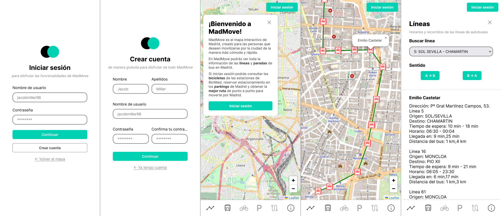
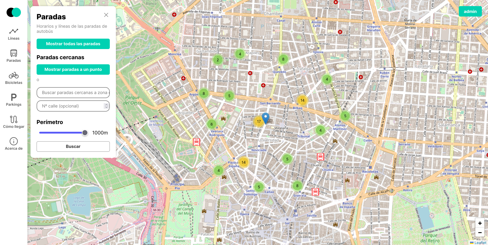
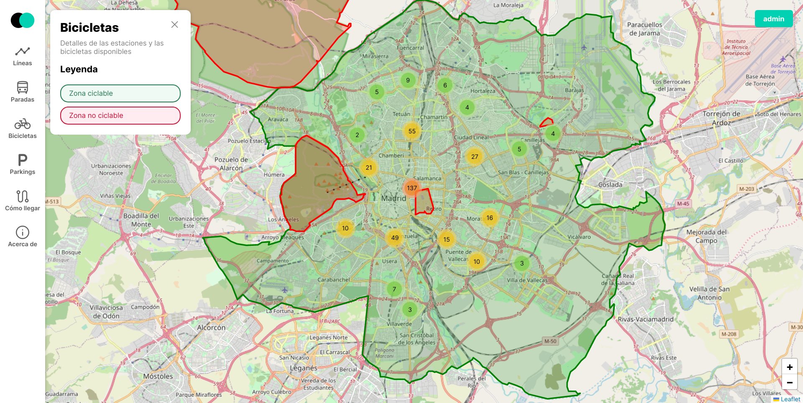
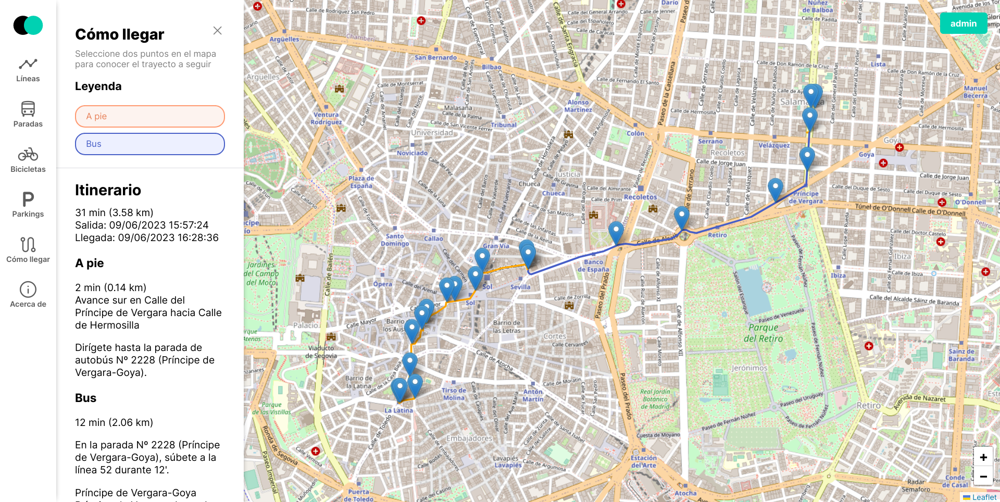

# MadMove

### 🇪🇸
MadMove es una aplicación web diseñada para facilitar la movilización en la ciudad de Madrid. 
En MadMove podrás consultar toda la  información acerca de las líneas y paradas de autobús, 
estaciones de bicicletas y parkings en toda la ciudad. Podrás ver el recorrido de cada linea, 
la hora de llegada del bus en tiempo real, el número de bicicletas en cada estación, los 
aparcamientos disponibles e incluso la mejor ruta para llegar de un sitio a otro.

Este proyecto ha estado basado completamente en la API de EMTMadrid (https://opendata.emtmadrid.es/Home) 
para la obtención de datos. Y utilizamos HTML, CSS & JS para el Frontend junto con PHP y MySQL para el Backend.

### 🇺🇸
MadMove is a web application designed to facilitate mobility in the city of Madrid. In MadMove 
you will be able to check all the information about bus lines and stops, bike stations and parking 
lots throughout the city. You will be able to see the route of each line, the arrival time of the bus 
in real time, the number of bicycles in each station, the available parking lots and even the best 
route to get from one place to another.

This project has been completely based on the EMTMadrid API (https://opendata.emtmadrid.es/Home) for data 
collection. And I used HTML, CSS & JS for the Frontend along with PHP and MySQL for the Backend.

## Demo

https://madmove-elisr.000webhostapp.com/

## Screenshots

